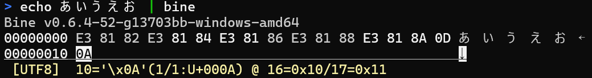

Bine - A terminal binary editor
================================

<!-- stdout: go run github.com/hymkor/example-into-readme/cmd/badges@master -->
[](https://github.com/hymkor/bine/actions/workflows/go.yml)
[](https://github.com/hymkor/bine/blob/master/LICENSE)
[](https://pkg.go.dev/github.com/hymkor/bine)
[](https://github.com/hymkor/bine)
<!-- -->



Key Features
------------

* **Fast startup with asynchronous loading**
  The viewer launches instantly and loads data in the background, allowing immediate interaction even with large files.

* **Supports both files and standard input**
  `bine` can read binary data not only from files but also from standard input, making it easy to use in pipelines.

* **Vi-style navigation**
  Navigation keys follow the familiar `vi` keybindings (`h`, `j`, `k`, `l`, etc.), allowing smooth movement for experienced users.  
(Note: File name input uses Emacs-style key bindings.)

* **Split-view with hex and character representations**
  The screen is divided approximately 2:1 between hexadecimal and character views. Supported encodings include UTF-8, UTF-16 (LE/BE), and the current Windows code page. You can switch encoding on the fly with key commands.

* **Smart decoding with character annotations**
  Multi-byte characters are visually grouped based on byte structure. Special code points such as BOMs and control characters (e.g., newlines) are annotated with readable names or symbols, making it easier to understand mixed binary/text content and debug encoding issues.

* **Minimal screen usage**
  `bine` only uses as many terminal lines as needed (1 line = 16 bytes), without occupying the full screen. This makes it easy to inspect or edit small binary data while still seeing the surrounding terminal output.

* **Cross-platform**
  Written in Go, `bine` runs on both Windows and Linux. It should also build and work on other Unix-like systems.

Install
--------

### Manual installation

Download the binary package from [Releases](https://github.com/hymkor/bine/releases) and extract the executable.

<!-- stdout: go run github.com/hymkor/example-into-readme/cmd/how2install@master -->

### Use [eget] installer (cross-platform)

```sh
brew install eget        # Unix-like systems
# or
scoop install eget       # Windows

cd (YOUR-BIN-DIRECTORY)
eget hymkor/bine
```

[eget]: https://github.com/zyedidia/eget

### Use [scoop]-installer (Windows only)

```
scoop install https://raw.githubusercontent.com/hymkor/bine/master/bine.json
```

or

```
scoop bucket add hymkor https://github.com/hymkor/scoop-bucket
scoop install bine
```

[scoop]: https://scoop.sh/

### Use "go install" (requires Go toolchain)

```
go install github.com/hymkor/bine/cmd/bine@latest
```

Note: `go install` places the executable in `$HOME/go/bin` or `$GOPATH/bin`, so you need to add this directory to your `$PATH` to run `bine`.
<!-- -->

Usage
-----

```
$ bine [FILES...]
```

or

```
$ cat FILE | bine
```

Key-binding
-----------

* `q`  
    * Quit
* `h`, `BACKSPACE`, `ARROW-LEFT`, `Ctrl-B`  
    * Move the cursor left
* `j`, `ARROW-DOWN`, `Ctrl-N`  
    * Move the cursor down
* `k`, `ARROW-UP`, `Ctrl-P`  
    * Move the cursor up
* `l`, `SPACE`, `ARROW-RIGHT`, `Ctrl-F`  
    * Move the cursor right
* `0` (zero), `^`, `Ctrl-A`  
    * Move the cursor to the beginning of the current line
    * `0` is available in View mode only
* `$`, `Ctrl-E`  
    * Move the cursor to the end of the current line
* `<`  
    * Move the cursor to the beginning of the file
* `>`, `G`  
    * Move the cursor to the end of the file
* `r`
    * Replace the byte under the cursor
* `R`
    * Toggle between View mode and Edit mode. (see "Modes" below)
    * In Edit mode, hexadecimal digits (`0-9`, `a-f`) overwrite the byte under the cursor
* `i`  
    * Insert data (e.g., `0xFF`, `U+0000`, `"string"`)
* `a`  
    * Append data (e.g., `0xFF`, `U+0000`, `"string"`)
    * Available in View mode only
* `x`, `DEL`  
    * Delete and yank the byte under the cursor
* `p`  
    * Paste one byte to the right side of the cursor
* `P`  
    * Paste one byte to the left side of the cursor
* `u`  
    * Undo
* `w`  
    * Write changes to file
* `&`  
    * Jump to a specific address
* `Meta-U`  
    * Change the character encoding to UTF-8 (default)
* `Meta-A`  
    * Change the character encoding to ANSI (the current Windows code page)
* `Meta-L`  
    * Change the character encoding to UTF-16LE
* `Meta-B`  
    * Change the character encoding to UTF-16BE

`Meta` means either `Alt`+`key` or `Esc` followed by key.

Modes
-----

The editor has two modes: View mode and Edit mode.

* View mode (default)
    * The file can be navigated safely without modifying data.
    * Most keys are interpreted as commands.
* Edit mode
    * Hexadecimal digits (`0-9`, `a-f`) directly modify the byte under the cursor.
    * The first digit replaces the high nibble and the second digit replaces the low nibble.
    * After two digits are entered, the cursor moves to the next byte.

Most command keys work in both modes.  
In Edit mode, only hexadecimal digits (`0-9`, `a-f`) are interpreted as data input.
Press `R` to toggle between View mode and Edit mode.

Changelog
---------

- [English](/CHANGELOG.md)
- [Japanese](/CHANGELOG_ja.md)

Contributing
------------

- Bug reports and improvement suggestions are welcome. You may write them in either English or Japanese.
- Please write comments in the code and commit messages in English.
- If a `develop` branch exists at the time of your pull request, please target it. Otherwise, `master` is fine.
- Test code and documentation updates that accompany code changes are appreciated, but not required. They can be added later if necessary.

Acknowledgements
----------------

- [spiegel-im-spiegel (Spiegel)](https://github.com/spiegel-im-spiegel) - [Issue #1](https://github.com/hymkor/bine/issues/1)

Author
------

- [hymkor (HAYAMA Kaoru)](https://github.com/hymkor)
